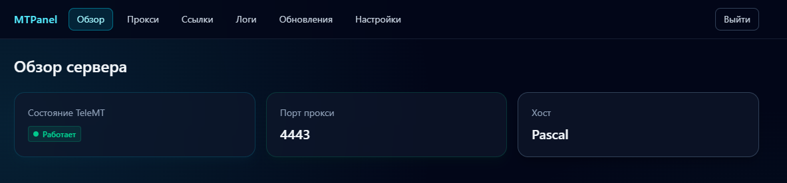
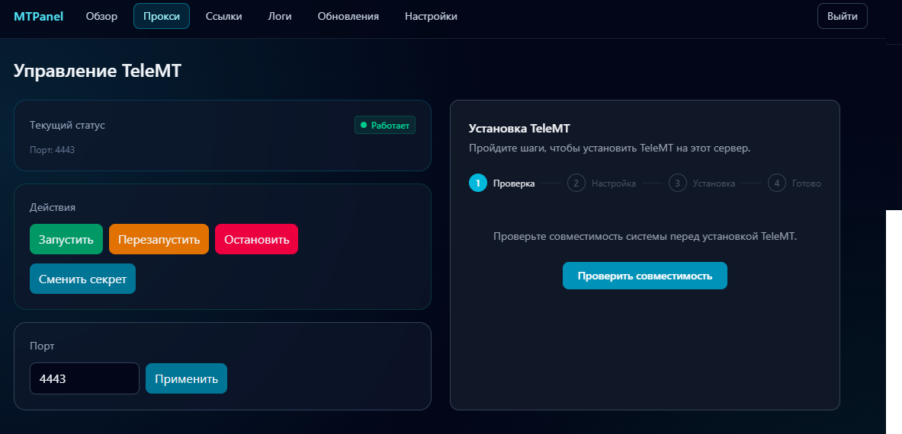
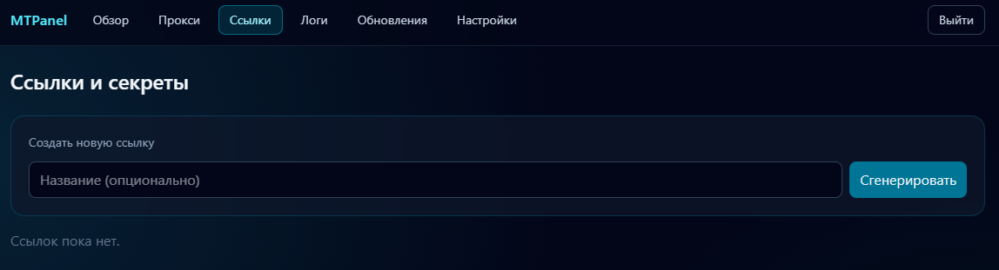
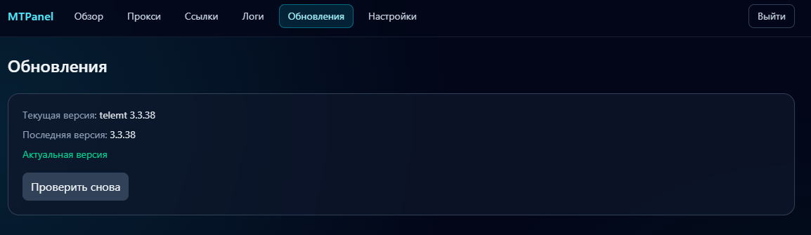

# MTPanel

Self-hosted control panel for **TeleMT** (`Go + SvelteKit + SQLite + systemd`).

[](LICENSE)
[](#)
[](#)

## Languages

- [Russian version](README.ru.md)
- [English version](README.en.md)

## Quick Start

```bash
curl -fsSL https://raw.githubusercontent.com/NikitaKHS/mtpanel/main/install.sh | sudo bash
```

## Screenshots

Gallery:

**Dashboard**


---

**Proxy**


---

**Links**


---

**Updates**


## Project Links

- Repository: <https://github.com/NikitaKHS/mtpanel>
- Installer: <https://raw.githubusercontent.com/NikitaKHS/mtpanel/main/install.sh>
